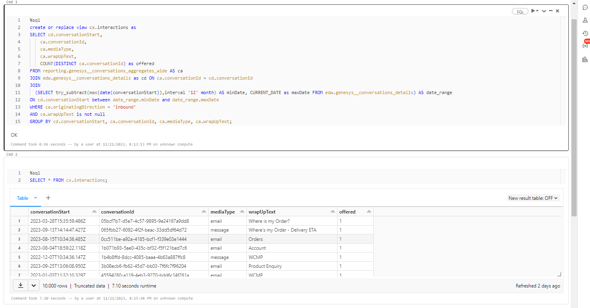
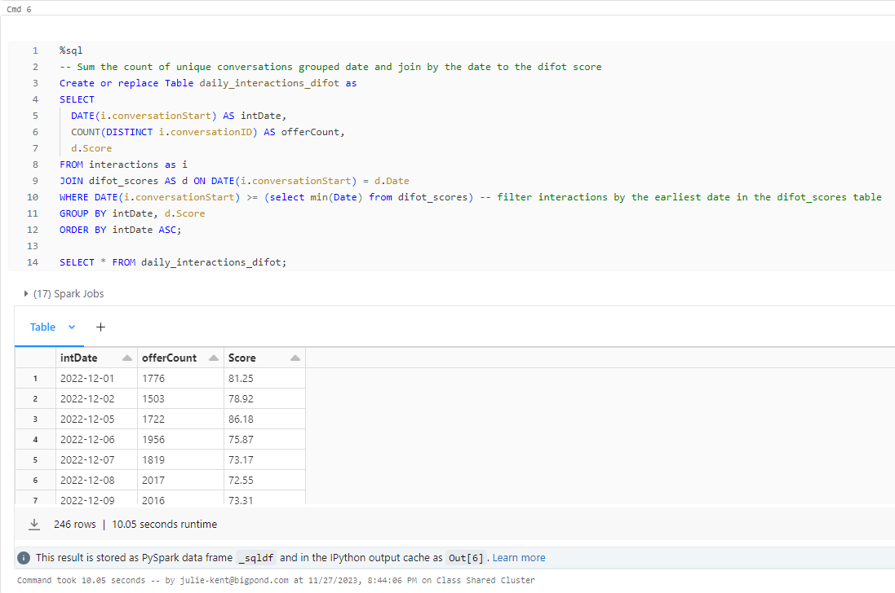
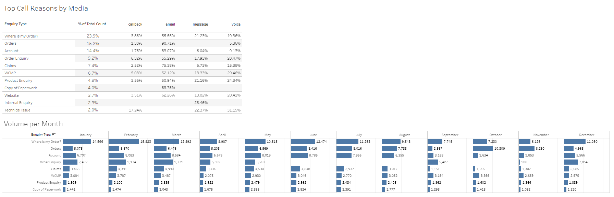

## **Contact Centre Operations and Performance**

Aims: 
1. Assess if a machine learning model would be effective in predicting contact centre volume based on DIFOT (delivered in full and on time) Scores.
2. Create visualisations on the correlation between call centre volume and DIFOT.
3. Assess other metrics including, volume by media type, volume by media type at each half hour interval, volume by reason.

If contact centre volume can be predicted to a reasonable degree of accuracy, the business can be more effective in the allocation of resources in the contact centre to ensure adherence to required SLAs and KPIs.

Understanding the reasons customers contact the business can assist with understanding where self-service capability can be increased to further reduce interaction volume.

### **Data and data delivery**

We have drawn data from a live Australia Contact Centre which operates utilising the Genesys PureCloud Contact Centre Platform.

As this is a live commercial business, an initial notebook was created within the business' Databricks environment which conducts a daily ingest of contact centre data via APIs and normalises into tables housed within the business' Databricks profile.

The primary API used is: '/api/v2/analytics/conversations/details'. Details about this API is available via https://developer.genesys.cloud/devapps/api-explorer however, Genesys Cloud Licencing, developer permissions and login credentials are required to run any of the APIs.

**Business Databricks Notebook for Initial Pull**

A second table of data was sourced, again, from the same business although exported as a cross tab from the business' Tableau environment which sources the related data from a SQL Management Server.  Again, this is data only accessible within the business and was filtered for a similar date range as the Genesys data prior to export and subsequent ingest into the study Databricks environment for further transformation.

**Resulting Databricks Table**

**Data Preparation for Machine Learning:**
    
Two distinct datasets were created; "daily_interactions_difot" and "int_by_MediaType".

After importing the CSV files into Google Colab, we initiated the data preparation process by introducing a new column named "flag" through a conditional statement.

The logic behind this statement was to assign a value of 1 if the current interaction count exceeded that of the previous day while simultaneously having a lower DIFOT score; otherwise, a value of 0 was assigned. 
Subsequently, we delved into hyperparameter tuning using Kerastuner, a library designed for systematically exploring hyperparameter spaces to enhance deep learning model performance. 

The top hyperparameter configurations were then applied to construct, train, and evaluate the machine learning models. 
This approach allowed us to optimise our models for both datasets, ultimately enhancing predictive accuracy and ensuring robust model performance.

**Machine Learning Model Development:**

Initially we employed a random forest model to predict and enhance data accuracy yielded an overall accuracy of 0.68, accompanied by a weighted F1-score of 0.65. 

Although the model displays some effectiveness, the F1 accuracy score falls below the targeted threshold of 75%, suggesting potential challenges 
in achieving consistent precision and recall across both classes. 

This underscores the necessity for further refinement and fine-tuning to bolster the model's predictive power, striving for a more balanced and accurate 
classification within the diverse categories of the dataset.

**Model Evaluation:**

Assess the model's performance using relevant metrics (e.g., accuracy, precision, recall).
Identify any areas for improvement and fine-tune the model if necessary.

The "Daily Interactions with DIFOT Score" model has been evaluated using key metrics, where it achieved a loss of 0.5335 and an accuracy of 75.81%. 

While the accuracy is a positive indicator, additional metrics such as precision and recall should be considered for a more comprehensive assessment. 

Precision measures the accuracy of positive predictions, while recall assesses the model's ability to capture all relevant instances. 

These metrics are particularly crucial if there are imbalances in the dataset or if certain outcomes carry greater significance. 
The current evaluation provides a foundation for understanding the model's overall performance, but further analysis is needed to identify areas for improvement. 

Fine-tuning the model based on insights gained from a more detailed examination of precision, recall, and potentially other relevant metrics 
could enhance its effectiveness in capturing daily interactions and improving the DIFOT Score.

The model for predicting "Daily Interactions with Media Type" has demonstrated commendable performance, boasting a low loss of 0.3282 and a high accuracy of 94.69%. 

These results suggest a robust ability to correctly classify instances of media interactions. However, to gain a more nuanced understanding of the model's efficacy, 
it's crucial to delve into precision and recall metrics.

Precision would elucidate the accuracy of positive predictions, ensuring that when the model identifies an interaction 
with a specific media type, it is highly likely to be accurate. 

Recall, on the other hand, assesses the model's capability to capture all relevant instances of a particular media type. 
A more detailed analysis of these metrics can unveil potential areas for improvement, allowing for targeted fine-tuning.

While the current accuracy is promising, refining the model based on precision and recall considerations could further enhance
its capacity to accurately predict and categorise daily interactions with media types.

### **Visualisations**

[Tableau Dashboards](https://public.tableau.com/app/profile/julie.kent5187/viz/Project4_17010577303390/Correlation?publish=yes)

The first visualisation created was the 'Interactions v DIFOT' scatter plot to determine the strength of the relationship between these two metrics.  

Overall, with an R-Squared value of 0.138377, there is a very weak, negative correlation between contact centre volume and DIFOT as represented in the visual.  Even when the data is filtered to represent volume related to order delivery, it still does not strongly support the correlation relationship with the R-Squared value only increasing to 0.25306.

However, when you look at the DIFOT scores across the 12 months represented in the data overlayed on the contact centre volumes per week, it can be viewed that there is a relationship between the reduced DIFOT driving an increase in contact centre volume (across December 2022/January 2023) and that the weak correlation could be driven by the otherwise stable DIFOT performance across that majority of the year.

The second set of visualisations created centred around the reason for the interactions.

While the top 3 reasons a customer contacts the contact centre are, 'Where's my Order?', 'Orders' (order creation) and, 'Account' (account related enquiries), the most popular reason for a customer to reach out through the contact centre is when they are looking for their order, representing 23.9% of the overall contact centre volume.  

Looking at the enquiry type volumes each month, the top 3-4 enquiry types remain consistent throughout the year.  As such, it is recommended that more self service development opportunities are explored in an effort to drive down this consistent volume.

Finally, a view of the interactions per half hour interval over the last 3 months shows the prevalence of interactions occurring over normal business hours for the East Coast.  While the contact centre is open from 8am to 8pm, Monday to Friday, it does take about an hour each morning for the volume to reach its average peak.  This does provide for an opportunity to stagger the start times of contact centre agents to flow in line with the ramping of volume along with how it tapers off at the end of the day.  This also supports a conclusion that the majority of agents should be allocated working hours in line with the East Coast business hours with a much smaller cohort covering the significantly reduced volume in the later part of the West Coast business hours.

### **Conclusion:**

In conclusion, the combination of machine learning models and visualisations provides a holistic view of contact centre performance. Strategic actions based on these insights can lead to improved resource management, better adherence to SLAs, and enhanced self-service capabilities, ultimately contributing to a more efficient and customer-centric contact centre operation.

### **Future Work:**
Some ideas to consider predicting future call volumes based on historical data for testing.

Propose potential areas for further analysis and refinement of the model.  Consider ongoing monitoring and updating of the model as new data becomes available.

**Time Series Forecasting:** Factor in seasonality, trends, and any other relevant patterns in the data.

**Call Arrival Rate Prediction:** Analyse patterns in historical data and incorporating external factors like time of day, day of the week, or special events.

**Average Handle Time Prediction:** Consider features such as the type of enquiry, customer information, and historical data on handling times.

**Agent Absence Rate Prediction:** Predict the absence rate of agents. Consider factors such as holidays, weekends, and historical absence patterns.

**Agent Utilisation Modelling:** Calculate agent utilisation rates based on historical data. This involves considering the number of agents available, call volumes, and average handle times to determine how efficiently agents are utilised.

**Staffing Requirement Calculation:** Combine the predicted call volumes, average handle times, and absence rates to calculate the required number of agents for each interval. 

**Machine Learning Regression Models:** Train regression models using features such as historical call volumes, average handle times, and absence rates to predict the number of agents needed.
