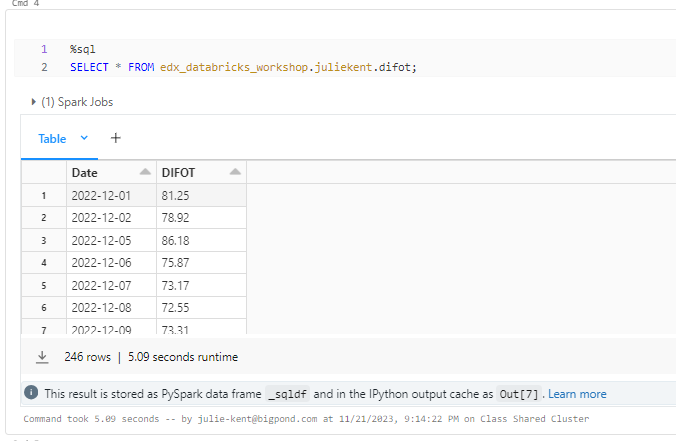

## Project 4

### Contact Centre Productivity and Performance Improvement

"Outline what we are planning to do"

#### *Data and data delivery*

We have drawn data from a live Australia Contact Centre which operates utilising the Genesys PureCloud Contact Centre Platform.

As this is a live commerical business, an initial notebook was created within the business' Databricks enviroment which conducts a daily ingest of contact centre data via APIs and normalises into tables housed within the bsuiness' Databricks profile.

The primary API used is: '/api/v2/analytics/conversations/details', which can be accessed via https://developer.genesys.cloud/devapps/api-explorer however, Genesys Cloud Licencing, developer permissions and login credentials are required to run any of the APIs available.

**Business Databricks Notebook for Initial Pull**

A second table of data was sourced again, from the same business although exported as a cross tab from the busness' Tableau envrionment which sources the related data from a SQL Management Server.  Again, this is data only accessible within the business and was filtered for the same date range as the Genesys data prior to export and subsequent ingest into the study Databricks environment for further transformation.

**Resulting Databricks Table**

1. Data Preparation for Machine Learning:
    
    Two distinct datasets were created; "Daily Interactions with DIFOT Score" and "Daily Interactions with Media Type and DIFOT Score."
    After importing the CSV files into Google Colab, we initiated the data preparation process by introducing a new column named "flag" through a conditional statement.

    

    The logic behind this statement was to assign a value of 1 if the current interaction count exceeded that of the previous day while simultaneously having a lower DIFOT score; otherwise, a value of 0 was assigned. 
    Subsequently, we delved into hyperparameter tuning using Kerastuner, a library designed for systematically exploring hyperparameter spaces to enhance deep learning model performance. 

    

    The top hyperparameter configurations were then applied to construct, train, and evaluate the machine learning models. 
    This approach allowed us to optimise our models for both datasets, ultimately enhancing predictive accuracy and ensuring robust model performance.

    

2. Machine Learning Model Development:

    Initially we employed a random forest model to predict and enhance data accuracy yielded an overall accuracy of 0.68, accompanied by a weighted F1-score of 0.65. 

    Although the model displays some effectiveness, the F1 accuracy score falls below the targeted threshold of 75%, suggesting potential challenges 
    in achieving consistent precision and recall across both classes. 

    This underscores the necessity for further refinement and fine-tuning to bolster the model's predictive power, striving for a more balanced and accurate 
    classification within the diverse categories of the dataset.

    

3. Model Evaluation:

    Assess the model's performance using relevant metrics (e.g., accuracy, precision, recall).
    Identify any areas for improvement and fine-tune the model if necessary.

    The "Daily Interactions with DIFOT Score" model has been evaluated using key metrics, where it achieved a loss of 0.5335 and an accuracy of 75.81%. 

    While the accuracy is a positive indicator, additional metrics such as precision and recall should be considered for a more comprehensive assessment. 

    Precision measures the accuracy of positive predictions, while recall assesses the model's ability to capture all relevant instances. 
    These metrics are particularly crucial if there are imbalances in the dataset or if certain outcomes carry greater significance. 
    The current evaluation provides a foundation for understanding the model's overall performance, but further analysis is needed to identify areas for improvement. 

    Fine-tuning the model based on insights gained from a more detailed examination of precision, recall, and potentially other relevant metrics 
    could enhance its effectiveness in capturing daily interactions and improving the DIFOT Score.

    

    The model for predicting "Daily Interactions with Media Type" has demonstrated commendable performance, boasting a low loss of 0.3282 and a high accuracy of 94.69%. 

    These results suggest a robust ability to correctly classify instances of media interactions. However, to gain a more nuanced understanding of the model's efficacy, 
    it's crucial to delve into precision and recall metrics. Precision would elucidate the accuracy of positive predictions, ensuring that when the model identifies an interaction 
    with a specific media type, it is highly likely to be accurate. 

    Recall, on the other hand, assesses the model's capability to capture all relevant instances of a particular media type. 
    A more detailed analysis of these metrics can unveil potential areas for improvement, allowing for targeted fine-tuning. While the current accuracy is promising, refining the model 
    based on precision and recall considerations could further enhance its capacity to accurately predict and categorise daily interactions with media types.

    

6. Normalisation for Visualisation:

    Normalise the model outputs for use in visualisations in Tableau.
    Ensure the compatibility of the machine learning model results with the visualisation tool.

7. Analysis 2 - Correlation Analysis:

    Use the data from Analysis 1 to perform correlation analysis.
    Examine the relationship between call reasons and media types.
    Identify patterns and trends that can inform self-service capability improvements.

#### *Visualisations*

[Draft Tableau Public](https://public.tableau.com/app/profile/julie.kent5187/viz/Project4_17010577303390/Sheet3?publish=yes)

Tableau

6. Result Visuals:

    Create visualisations to represent the correlation findings.
    Utilise Tableau to develop interactive dashboards for easy interpretation.
    Highlight key insights and areas for improvement.

6. Normalisation for Visualisation:
Normalise the model outputs for use in visualisations in Tableau.
Ensure the compatibility of the machine learning model results with the visualisation tool.

7. Analysis 2 - Correlation Analysis:
Use the data from Analysis 1 to perform correlation analysis.
Examine the relationship between call reasons and media types.
Identify patterns and trends that can inform self-service capability improvements.

7. Conclusion:
    Summarise the key findings from both analyses.
    Discuss the implications for resource allocation, SLA adherence, and self-service improvements.
    Recommend actionable steps based on the results.

8. Future Work:
    Propose potential areas for further analysis and refinement of the model.
    Consider ongoing monitoring and updating of the model as new data becomes available.

##########Some ideas to consider predicting future call volumes based on historical data for testing; ###############

### Time Series Forecasting:
Factor in seasonality, trends, and any other relevant patterns in the data.

### Call Arrival Rate Prediction:
Analyse patterns in historical data and incorporating external factors like time of day, day of the week, or special events.

### Average Handle Time Prediction:
Consider features such as the type of inquiry, customer information, and historical data on handling times.

### Agent Absence Rate Prediction:
Predict the absence rate of agents. Consider factors such as holidays, weekends, and historical absence patterns.

### Agent Utilisation Modelling:
Calculate agent utilisation rates based on historical data. This involves considering the number of agents available, call volumes, and average handle times to determine how efficiently agents are utilised.

### Staffing Requirement Calculation:
Combine the predicted call volumes, average handle times, and absence rates to calculate the required number of agents for each interval. 

### Machine Learning Regression Models:
Train regression models using features such as historical call volumes, average handle times, and absence rates to predict the number of agents needed.
